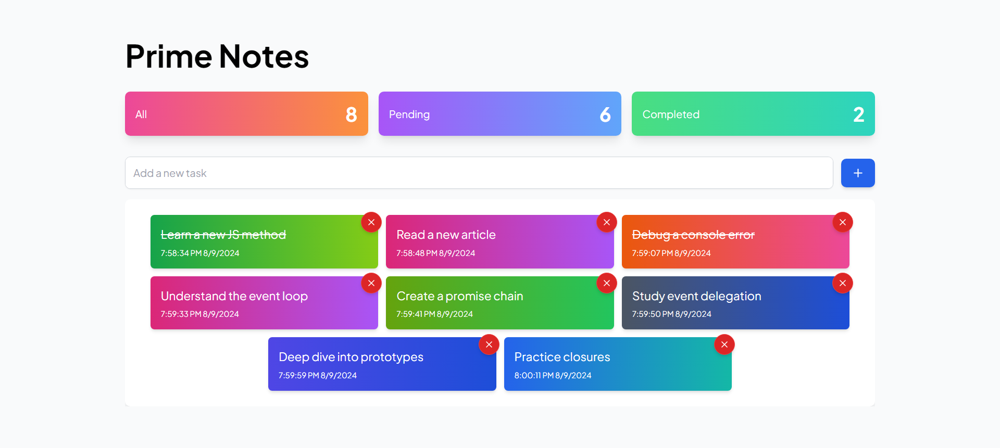

# 📝 PrimeNotes

Welcome to **PrimeNotes**! This application allows you to efficiently manage your tasks with essential features like adding, deleting, and editing todos. It also provides an overview of your tasks by showing the total number of todos, completed todos, and pending todos. Your todos are stored in the browser's **local storage**, ensuring they persist even after refreshing the page.



## ✨ Features

- **Add Todo**: Quickly add new tasks to your list.
- **Delete Todo**: Remove tasks you no longer need.
- **Edit Todo**: Modify existing tasks as your priorities change.
- **Task Overview**: Get a clear view of:
  - Total todos
  - Completed todos
  - Pending todos
- **Local Storage**: Your todos are saved in the browser's local storage, so they persist even after refreshing the page.

## 🛠️ Technologies Used

- **React** ⚛️: JavaScript library for building user interfaces
- **Vite** ⚡: Next-generation frontend tooling for fast builds and development
- **Tailwind CSS** 🎨: Utility-first CSS framework for rapid UI development
- **Lucide React** 🔧: Icon library providing a collection of customizable icons for React

## 🚀 Getting Started

Follow these steps to set up and run the project on your local machine.

### Prerequisites

Ensure you have the following installed:

- **Node.js** (version 14 or higher)
- **npm** or **yarn** (for package management)

### Installation

1. **Clone the repository:**

   ```bash
   git clone https://github.com/yourusername/PrimeNotes.git
   cd PrimeNotes
   ```

2. **Install dependencies:**

   Using npm:

   ```bash
   npm install
   ```

   Or using yarn:

   ```bash
   yarn install
   ```

### Running the Application

To run the app locally, execute the following command:

- Using npm:

  ```bash
  npm run dev
  ```

- Using yarn:

  ```bash
  yarn dev
  ```

After running the above command, open your browser and navigate to `http://localhost:5173` to see the app in action!
